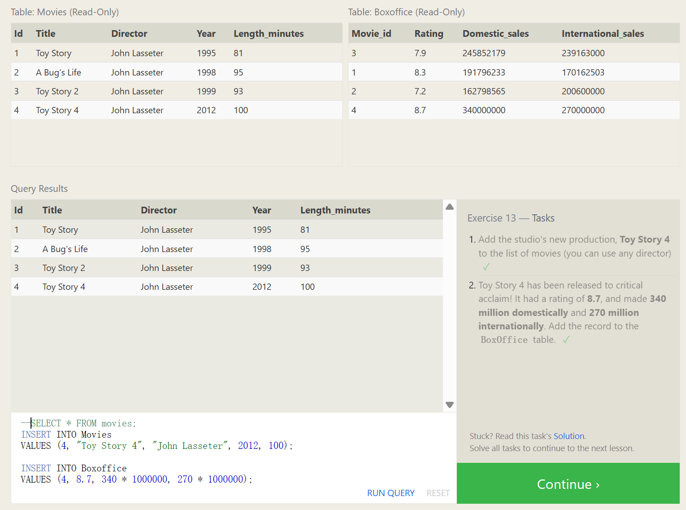
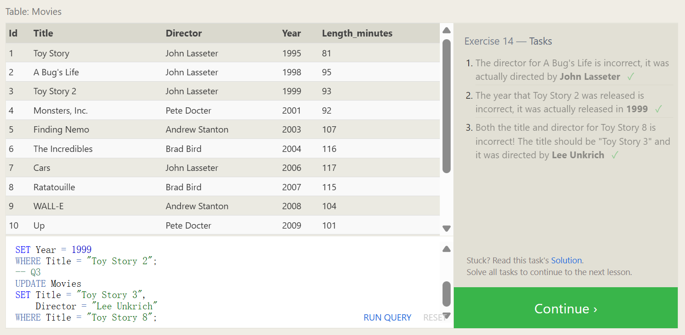
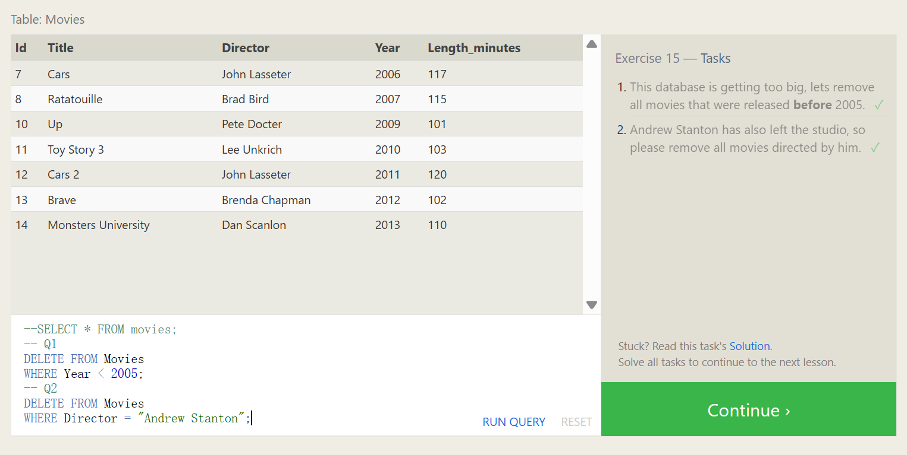
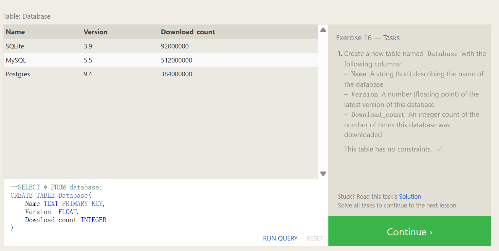
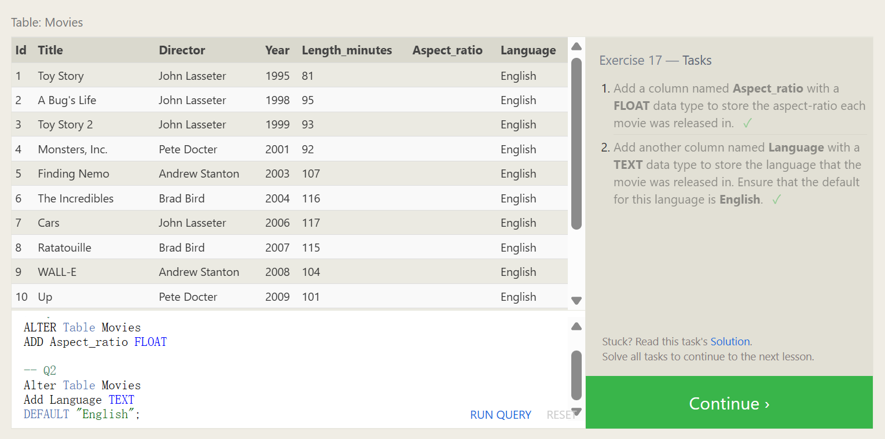
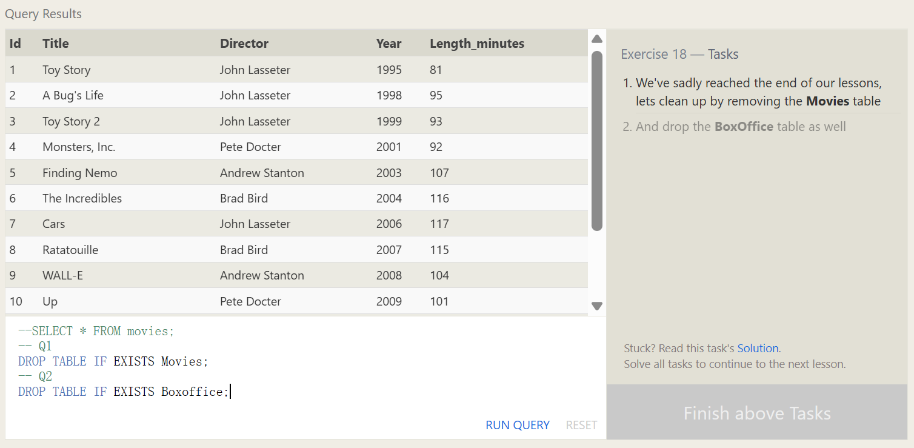

# Rows and Tables

We previously described a table in a database as a two-dimensional set of rows and columns, with the columns being the properties and the rows being instances of the entity in the table. In SQL, the *database schema* is what describes the structure of each table, and the datatypes that each column of the table can contain.

# Inserting new data

When inserting data into a database, we need to use an `INSERT` statement, which declares which table to write into, the columns of data that we are filling, and one or more rows of data to insert. In general, each row of data you insert should contain values for every corresponding column in the table. You can insert multiple rows at a time by just listing them sequentially.

Insert statement with values for all columns

```sql
INSERT INTO mytable VALUES (value_or_expr, another_value_or_expr, …),       (value_or_expr_2, another_value_or_expr_2, …),       …;
```

In some cases, if you have incomplete data and the table contains columns that support default values, you can insert rows with only the columns of data you have by specifying them explicitly.

Insert statement with specific columns

```sql
INSERT INTO mytable (column, another_column, …) VALUES (value_or_expr, another_value_or_expr, …),      (value_or_expr_2, another_value_or_expr_2, …),      …;
```

In these cases, the number of values need to match the number of columns specified. Despite this being a more verbose statement to write, inserting values this way has the benefit of being forward compatible. For example, if you add a new column to the table with a default value, no hardcoded `INSERT` statements will have to change as a result to accommodate that change.

In addition, you can use mathematical and string expressions with the values that you are inserting.
This can be useful to ensure that all data inserted is formatted a certain way.

Example Insert statement with expressions

```sql
INSERT INTO boxoffice (movie_id, rating, sales_in_millions) VALUES (1, 9.9, 283742034 / 1000000);
```


```SQL
-- SELECT * FROM movies;
INSERT INTO Movies
VALUES (4, "Toy Story 4", "John Lasseter", 2012, 100);

INSERT INTO Boxoffice
VALUES (4, 8.7, 340 * 1000000, 270 * 1000000);
```




# **Updating rows**

In addition to adding new data, a common task is to update existing data, which can be done using an `UPDATE` statement. Similar to the `INSERT` statement, you have to specify exactly which table, columns, and rows to update. In addition, the data you are updating has to match the data type of the columns in the table schema.

Update statement with values

```SQL
UPDATE mytable SET column = value_or_expr,     other_column = another_value_or_expr,     … 
WHERE condition;
```

The statement works by taking multiple column/value pairs, and applying those changes to each and every row that satisfies the constraint in the `WHERE` clause.


```sql
--SELECT * FROM movies;
-- Q1
UPDATE Movies
SET Director = "John Lasseter"
WHERE Title = "A Bug's Life";
-- Q2
UPDATE Movies
SET Year = 1999
WHERE Title = "Toy Story 2";
-- Q3
UPDATE Movies
SET Title = "Toy Story 3",
    Director = "Lee Unkrich"
WHERE Title = "Toy Story 8";
```




# **SQL Lesson 15: Deleting rows**

When you need to delete data from a table in the database, you can use a `DELETE` statement, which describes the table to act on, and the rows of the table to delete through the `WHERE` clause.

Delete statement with condition

```sql
DELETE FROM mytable WHERE condition;
```


```sql
--SELECT * FROM movies;
-- Q1
DELETE FROM Movies
WHERE Year < 2005;
-- Q2
DELETE FROM Movies
WHERE Director = "Andrew Stanton";
```




# SQL Lesson 16: Creating tables

When you have new entities and relationships to store in your database, you can create a new database table using the `CREATE TABLE` statement.

Create table statement w/ optional table constraint and default value

```sql
CREATE TABLE IF NOT EXISTS mytable (    
    column DataType TableConstraint DEFAULT default_value,
    another_column DataType TableConstraint DEFAULT default_value,
    …
);
```


# Table data types

Different databases support different data types, but the common types support numeric, string, and other miscellaneous things like dates, booleans, or even binary data. Here are some examples that you might use in real code.

| Data type                                            | Description                                                  |
| ---------------------------------------------------- | ------------------------------------------------------------ |
| `INTEGER`, `BOOLEAN`                                 | The integer datatypes can store whole integer values like the count of a number or an age. In some implementations, the boolean value is just represented as an integer value of just 0 or 1. |
| `FLOAT`, `DOUBLE`, `REAL`                            | The floating point datatypes can store more precise numerical data like measurements or fractional values. Different types can be used depending on the floating point precision required for that value. |
| `CHARACTER(num_chars)`, `VARCHAR(num_chars)`, `TEXT` | The text based datatypes can store strings and text in all sorts of locales. The distinction between the various types generally amount to underlaying efficiency of the database when working with these columns.Both the CHARACTER and VARCHAR (variable character) types are specified with the max number of characters that they can store (longer values may be truncated), so can be more efficient to store and query with big tables. |
| `DATE`, `DATETIME`                                   | SQL can also store date and time stamps to keep track of time series and event data. They can be tricky to work with especially when manipulating data across timezones. |
| `BLOB`                                               | Finally, SQL can store binary data in blobs right in the database. These values are often opaque to the database, so you usually have to store them with the right metadata to requery them. |

# Table constraints

We aren't going to dive too deep into table constraints in this lesson, but each column can have additional table constraints on it which limit what values can be inserted into that column. This is not a comprehensive list, but will show a few common constraints that you might find useful.

| Constraint           | Description                                                  |
| -------------------- | ------------------------------------------------------------ |
| `PRIMARY KEY`        | This means that the values in this column are unique, and each value can be used to identify a single row in this table. |
| `AUTOINCREMENT`      | For integer values, this means that the value is automatically filled in and incremented with each row insertion. Not supported in all databases. |
| `UNIQUE`             | This means that the values in this column have to be unique, so you can't insert another row with the same value in this column as another row in the table. Differs from the `PRIMARY KEY` in that it doesn't have to be a key for a row in the table. |
| `NOT NULL`           | This means that the inserted value can not be `NULL`.        |
| `CHECK (expression)` | This allows you to run a more complex expression to test whether the values inserted are valid. For example, you can check that values are positive, or greater than a specific size, or start with a certain prefix, etc. |
| `FOREIGN KEY`        | This is a consistency check which ensures that each value in this column corresponds to another value in a column in another table.  For example, if there are two tables, one listing all Employees by ID, and another listing their payroll information, the `FOREIGN KEY` can ensure that every row in the payroll table corresponds to a valid employee in the master Employee list. |


# An example

Here's an example schema for the *Movies* table that we've been using in the lessons up to now.

Movies table schema

```sql
CREATE TABLE movies (    
    id INTEGER PRIMARY KEY,    
    title TEXT,
    director TEXT,
    year INTEGER,
    length_minutes INTEGER
);
```


```sql
--SELECT * FROM database;
CREATE TABLE Database(
    Name TEXT PRIMARY KEY,
    Version  FLOAT,
    Download_count INTEGER
)
```




# SQL Lesson 17: Altering tables

As your data changes over time, SQL provides a way for you to update your corresponding tables and database schemas by using the `ALTER TABLE` statement to add, remove, or modify columns and table constraints.

# Adding columns

The syntax for adding a new column is similar to the syntax when creating new rows in the `CREATE TABLE` statement. You need to specify the data type of the column along with any potential table constraints and default values to be applied to both existing *and* new rows. In some databases like MySQL, you can even specify where to insert the new column using the `FIRST` or `AFTER` clauses, though this is not a standard feature.

Altering table to add new column(s)

```sql
ALTER TABLE mytable 
ADD column DataType OptionalTableConstraint
	DEFAULT default_value;
```

# Removing columns

Dropping columns is as easy as specifying the column to drop, however, some databases (including SQLite) don't support this feature. Instead you may have to create a new table and migrate the data over.

Altering table to remove column(s)

```sql
ALTER TABLE mytable 
DROP column_to_be_deleted;
```

# Renaming the table

If you need to rename the table itself, you can also do that using the `RENAME TO` clause of the statement.

Altering table name

```sql
ALTER TABLE mytable 
RENAME TO new_table_name;
```


```sql
--SELECT * FROM movies;
-- Q1
ALTER Table Movies
ADD Aspect_ratio FLOAT 

-- Q2
Alter Table Movies
Add Language TEXT
DEFAULT "English";
```




# SQL Lesson 18: Dropping tables

In some rare cases, you may want to remove an entire table including all of its data and metadata, and to do so, you can use the `DROP TABLE` statement, which differs from the `DELETE` statement in that it also removes the table schema from the database entirely.

Drop table statement

```sql
DROP TABLE IF EXISTS mytable;
```

Like the `CREATE TABLE` statement, the database may throw an error if the specified table does not exist, and to suppress that error, you can use the `IF EXISTS` clause.

In addition, if you have another table that is dependent on columns in table you are removing (for example, with a `FOREIGN KEY` dependency) then you will have to either update all dependent tables first to remove the dependent rows or to remove those tables entirely.

```sql
--SELECT * FROM movies;
-- Q1
DROP TABLE IF EXISTS Movies;
-- Q2
DROP TABLE IF EXISTS Boxoffice;
```

