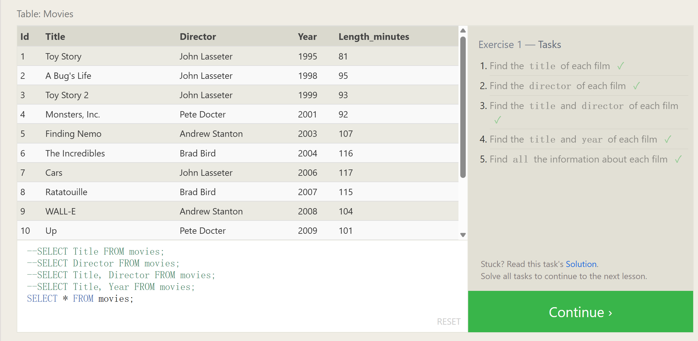

# SELECT_queries

And given a table of data, the most basic query we could write would be one that selects for a couple columns (properties) of the table with all the rows (instances).

Select query for a specific columns: 

```sqlite
SELECT column, another_column, … FROM mytable;
```

The result of this query will be a two-dimensional set of rows and columns, effectively a copy of the table, but only with the columns that we requested.

If we want to retrieve absolutely all the columns of data from a table, we can then use the asterisk (`*`) shorthand in place of listing all the column names individually.

Select query for all columns: 

```sql
SELECT *  FROM mytable;
```

