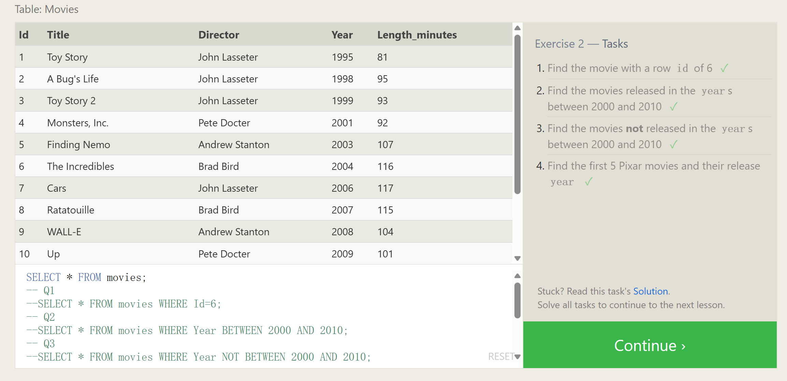

# Queries with constraints(Pt.1)

In order to filter certain results from being returned, we need to use a `WHERE` clause in the query. The clause is applied to each row of data by checking specific column values to determine whether it should be included in the results or not.

Select query with constraints

```sql
SELECT column, another_column, … FROM mytable WHERE condition  AND/OR another_condition    AND/OR …;
```

More complex clauses can be constructed by joining numerous `AND` or `OR` logical keywords (ie. num_wheels >= 4 AND doors <= 2). And below are some useful operators that you can use for numerical data (ie. integer or floating point):

| Operator            | Condition                                            | SQL Example                           |
| ------------------- | ---------------------------------------------------- | ------------------------------------- |
| =, !=, <, <=, >, >= | Standard numerical operators                         | col_name **!=** 4                     |
| BETWEEN … AND …     | Number is within range of two values (inclusive)     | col_name **BETWEEN** 1.5 **AND** 10.5 |
| NOT BETWEEN … AND … | Number is not within range of two values (inclusive) | col_name **NOT BETWEEN** 1 **AND** 10 |
| IN (…)              | Number exists in a list                              | col_name **IN** (2, 4, 6)             |
| NOT IN (…)          | Number does not exist in a list                      | col_name **NOT IN** (1, 3, 5)         |




**When using keyword "between", the order of the number should be correct, otherwise you will not be able to get any number.**

```sql
SELECT * FROM movies;
-- Q1
--SELECT * FROM movies WHERE Id=6;
-- Q2
--SELECT * FROM movies WHERE Year BETWEEN 2000 AND 2010;
-- Q3
--SELECT * FROM movies WHERE Year NOT BETWEEN 2000 AND 2010;
-- Q4 several ways to achieve
--SELECT * FROM movies WHERE Id<=5;
--SELECT * FROM movies WHERE Id BETWEEN 1 AND 5 注意这里不能乱序
--SELECT * FROM movies WHERE Id IN (1, 2, 3, 4, 5)
--SELECT * FROM movies WHERE Id<=5 AND Id>0
--SELECT * FROM movies WHERE NOT Id>5
```

