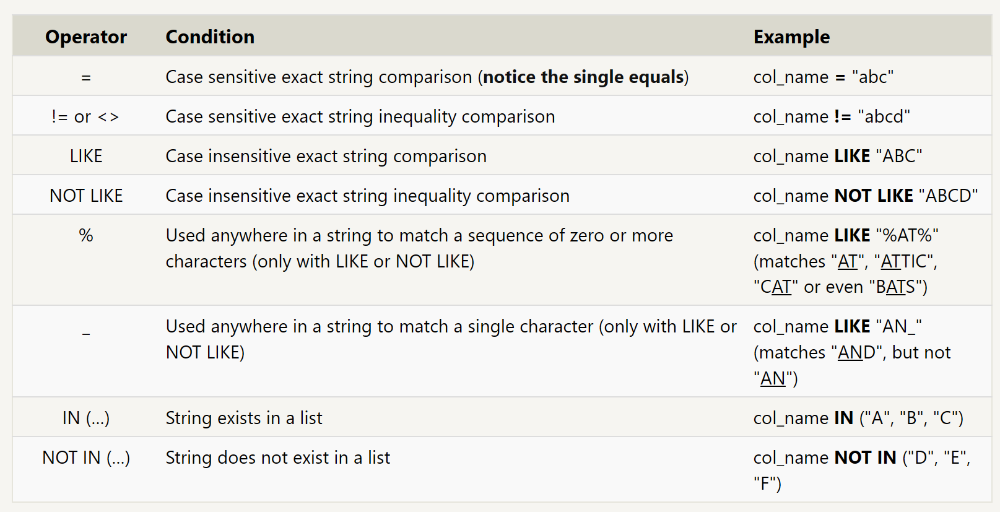
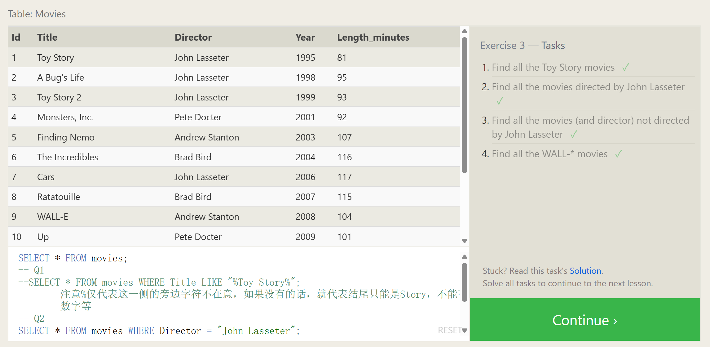

# **Queries with constraints (Pt. 2)**





```sql
--SELECT * FROM movies;
-- Q1
--SELECT * FROM movies WHERE Title LIKE "%Toy Story%"; 注意%仅代表这一侧的旁边字符不在意，如果没有的话，就代表结尾只能是Story，不能有数字等

-- Q2
SELECT * FROM movies WHERE Director = "John Lasseter";
-- Q3
SELECT * FROM movies WHERE Director != "John Lasseter";
-- Q4
SELECT * FROM movies WHERE Title LIKE "WALL-_"
```

