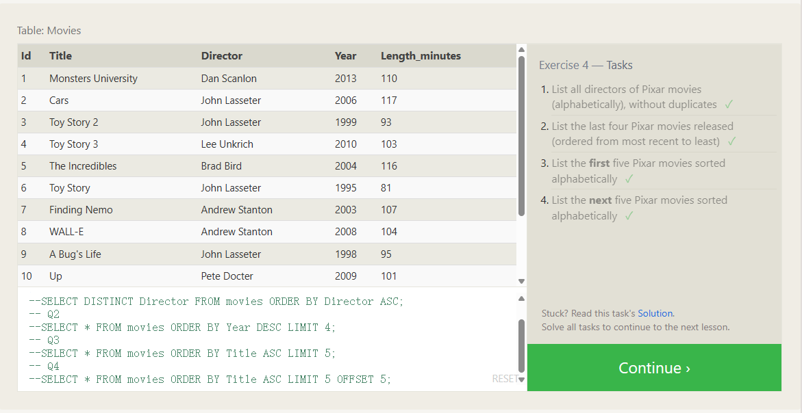

# **Filtering and sorting Query results**

Even though the data in a database may be unique, the results of any particular query may not be – take our Movies table for example, many different movies can be released the same year. In such cases, SQL provides a convenient way to discard rows that have a duplicate column value by using the `DISTINCT` keyword.

对于去除重复有duplicate列的某些行（比如有些电影都是在同一年release的）

Select query with unique results

```sql
SELECT DISTINCT column, another_column, … FROM mytable WHERE condition(s);
```


## ordering results

Unlike our neatly ordered table in the last few lessons, most data in real databases are added in no particular column order. As a result, it can be difficult to read through and understand the results of a query as the size of a table increases to thousands or even millions rows.

To help with this, SQL provides a way to sort your results by a given column in ascending or descending order using the `ORDER BY` clause.

Select query with ordered results

```sql
SELECT column, another_column, … FROM mytable WHERE condition(s)ORDER BY column ASC/DESC; --ascending升序，descending降序
```

注意这里是ASC和DESC不要拼错了


Another clause which is commonly used with the `ORDER BY` clause are the `LIMIT` and `OFFSET` clauses, which are a useful optimization to indicate to the database the subset of the results you care about.
The `LIMIT` will reduce the number of rows to return, and the optional `OFFSET` will specify where to begin counting the number rows from.

对于取出的数据，如果只想要看到其中一小部分的数据，就用limit限制数量，如果要限制区域起始，则用offset

Select query with limited rows

```sql
SELECT column, another_column, … FROM mytable WHERE condition(s) ORDER BY column ASC/DESC LIMIT num_limit OFFSET num_offset;
```




```SQL
--SELECT * FROM movies;
-- Q1
--SELECT DISTINCT Director FROM movies ORDER BY Director ASC;
-- Q2
--SELECT * FROM movies ORDER BY Year DESC LIMIT 4;
-- Q3
--SELECT * FROM movies ORDER BY Title ASC LIMIT 5;
-- Q4
SELECT * FROM movies ORDER BY Title ASC LIMIT 5 OFFSET 5;
```

