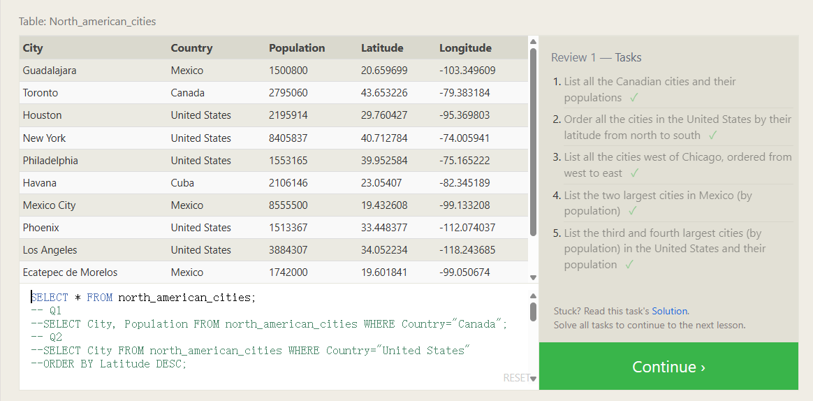

# Review

SELECT query

```sql
SELECT column, another_column, … 
FROM mytable 
WHERE *condition(s)* 
ORDER BY column ASC/DESC 
LIMIT num_limit 
OFFSET num_offset;
```



```SQL
--SELECT * FROM north_american_cities;
-- Q1
--SELECT City, Population FROM north_american_cities WHERE Country="Canada";
-- Q2
--SELECT City FROM north_american_cities WHERE Country="United States"
--ORDER BY Latitude DESC;

-- Q3
--SELECT Longitude FROM north_american_cities WHERE City="Chicago";
-- -87.629798

SELECT City FROM north_american_cities WHERE Longitude<"-87.629798" ORDER BY Longitude ASC;

-- Q3 another approach 在这里将上面的句子直接嵌套在了语句中，用括号括起来
SELECT City FROM north_american_cities WHERE Longitude<(SELECT Longitude FROM north_american_cities WHERE City="Chicago") ORDER BY Longitude ASC;


-- Q4
SELECT City FROM north_american_cities
WHERE Country="Mexico"
ORDER BY Population DESC
LIMIT 2;

-- Q5
SELECT City FROM north_american_cities
WHERE Country="United States"
ORDER BY Population DESC
LIMIT 2
OFFSET 2;
```

对于Q3，也有比较简便的一次性取出方法