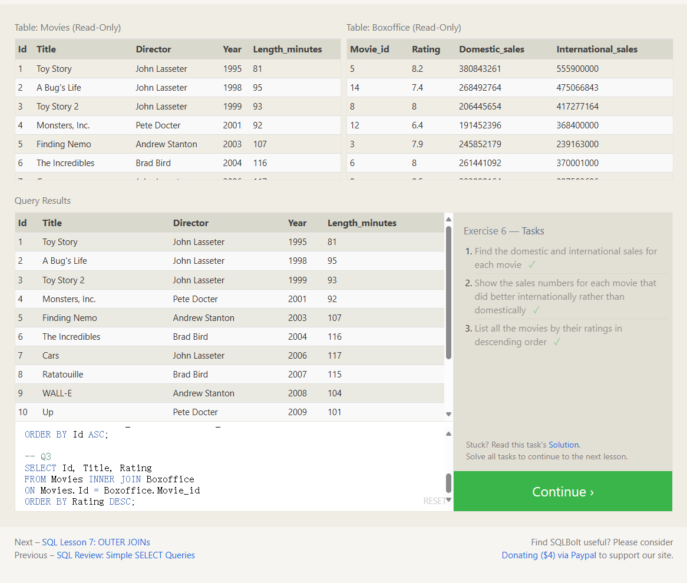

Up to now, we've been working with a single table, but entity data in the real world is often broken down into pieces and stored across multiple orthogonal tables using a process known as *normalization*[[1\]](http://en.wikipedia.org/wiki/Database_normalization).

# Multi-table queries with JOINs

Tables that share information about a single entity need to have a *primary key* that identifies that entity *uniquely* across the database. One common primary key type is an auto-incrementing integer (because they are space efficient), but it can also be a string, hashed value, so long as it is unique.

Using the `JOIN` clause in a query, we can combine row data across two separate tables using this unique key. The first of the joins that we will introduce is the `INNER JOIN`.

Select query with INNER JOIN on multiple tables

```sql
SELECT column, another_table_column, … 
FROM mytable INNER JOIN another_table     
ON mytable.id = another_table.id 
WHERE condition(s) ORDER BY column, … ASC/DESC 
LIMIT num_limit 
OFFSET num_offset;
```

**Resulting table only contains data that ==belongs in both of the tables.==**

```sql
--SELECT * FROM movies;
-- Q1
SELECT Id, Title, Domestic_sales,International_sales
FROM Movies INNER JOIN Boxoffice
ON Movies.Id = Boxoffice.Movie_id
ORDER BY Id ASC;

-- Q2
SELECT Id, Title, Domestic_sales,International_sales
FROM Movies INNER JOIN Boxoffice
ON Movies.Id = Boxoffice.Movie_id
WHERE International_sales > Domestic_sales
ORDER BY Id ASC;

-- Q3
SELECT Id, Title, Rating
FROM Movies INNER JOIN Boxoffice
ON Movies.Id = Boxoffice.Movie_id
ORDER BY Rating DESC;
```

注意这里SELECT关键词后面可以选择到两个表的列，只要你用inner join关键词

