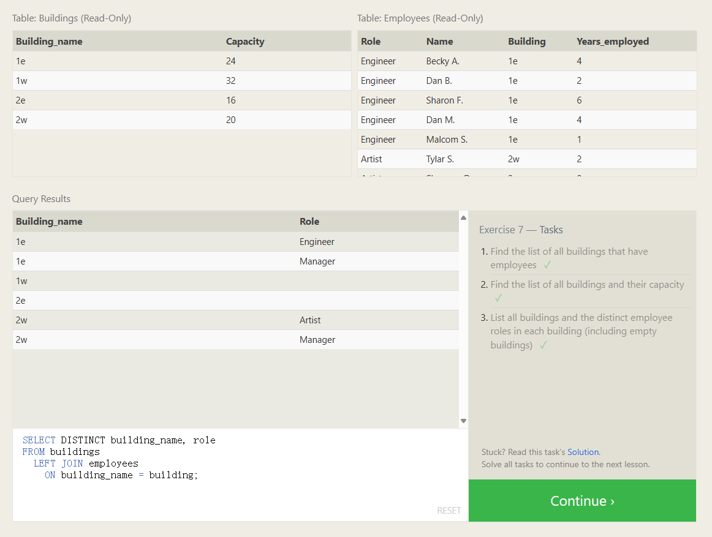

# OUTER JOINs(交集选取行)

Depending on how you want to analyze the data, the `INNER JOIN` we used last lesson might not be sufficient because the resulting table only contains data that belongs in both of the tables.

If the two tables have asymmetric data, which can easily happen when data is entered in different stages, then we would have to use a `LEFT JOIN`, `RIGHT JOIN` or `FULL JOIN` instead to ensure that the data you need is not left out of the results.

```sql
SELECT column, another_column, …
FROM mytable
INNER/LEFT/RIGHT/FULL JOIN another_table 
    ON mytable.id = another_table.matching_id
WHERE condition(s)
ORDER BY column, … ASC/DESC
LIMIT num_limit OFFSET num_offset;
```

Like the `INNER JOIN` these three new joins have to specify which column to join the data on.
When joining table A to table B, a `LEFT JOIN` simply includes rows from A regardless of whether a matching row is found in B. The `RIGHT JOIN` is the same, but reversed, keeping rows in B regardless of whether a match is found in A. Finally, a `FULL JOIN` simply means that rows from both tables are kept, regardless of whether a matching row exists in the other table.

LEFT JOIN 保留所有左侧表的元素，RIGHT JOIN 则相反，FULL JOIN 则两侧都保留，少的就用NULL填充

```sql
-- Q1
SELECT DISTINCT Building FROM Employees;

-- Q2
SELECT * FROM Buildings

-- Q3
SELECT DISTINCT building_name, role 
FROM buildings 
  LEFT JOIN employees
    ON building_name = building;
```

