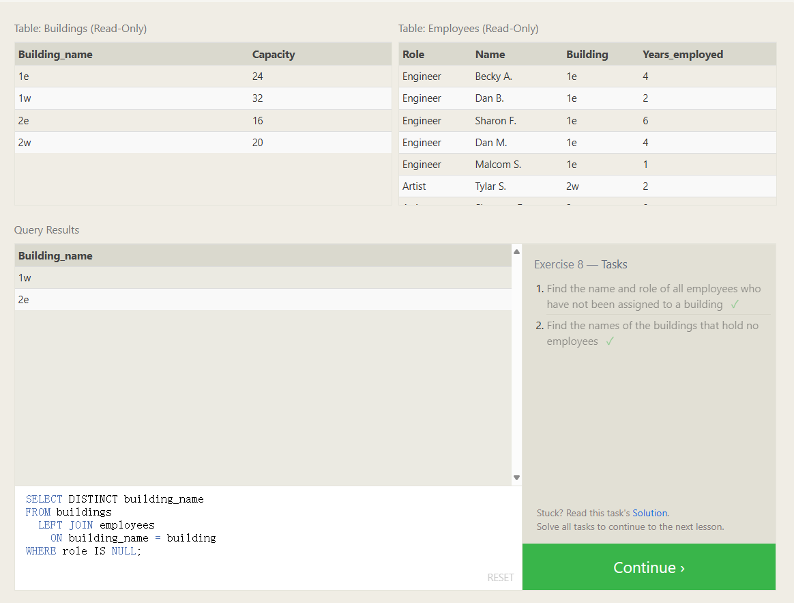

# A short note on NULLs

As promised in the last lesson, we are going to quickly talk about `NULL` values in an SQL database. It's always good to reduce the possibility of `NULL` values in databases because they require special attention when constructing queries, constraints (certain functions behave differently with null values) and when processing the results.

Sometimes, it's also not possible to avoid `NULL` values, as we saw in the last lesson when outer-joining two tables with asymmetric data. In these cases, you can test a column for `NULL` values in a `WHERE` clause by using either the `IS NULL` or `IS NOT NULL` constraint.

Select query with constraints on NULL values

```sql
SELECT column, another_column, … 
FROM mytable 
WHERE column IS/IS NOT NULL AND/OR another_condition AND/OR …;
```

JOIN ON关键词，直接写列名即可，不用考虑在前面加上表名说明

```sql
--SELECT * FROM employees;
SELECT Role, Name
FROM Employees
WHERE Building IS NULL;

SELECT Building_name
FROM Buildings 
LEFT JOIN Employees
ON Buildings.Building_name = Employees.Building; --这种写法是错的，不能用.
WHERE Role IS NULL;

SELECT DISTINCT Building_name
FROM Buildings 
LEFT JOIN Employees
ON building_name = building
WHERE Role IS NULL;
```

