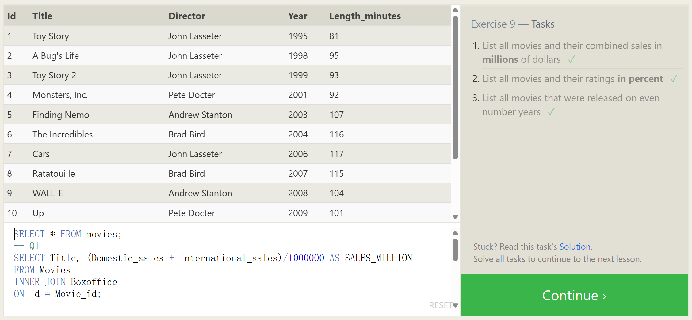

In addition to querying and referencing raw column data with SQL, you can also use *expressions* to write more complex logic on column values in a query. These expressions can use mathematical and string functions along with basic arithmetic to transform values when the query is executed, as shown in this physics example.

Example query with expressions

```sql
SELECT particle_speed / 2.0 AS half_particle_speed FROM physics_data WHERE ABS(particle_position) * 10.0 > 500;
```

The use of expressions can save time and extra post-processing of the result data, but can also make the query harder to read, so we recommend that when expressions are used in the `SELECT` part of the query, that they are also given a descriptive *alias* using the `AS` keyword.

Select query with expression aliases

```sql
SELECT col_expression AS expr_description, … 
FROM mytable;
```

In addition to expressions, regular columns and even tables can also have aliases to make them easier to reference in the output and as a part of simplifying more complex queries.

Example query with both column and table name aliases

```sql
SELECT column AS better_column_name, … 
FROM a_long_widgets_table_name AS mywidgets 
INNER JOIN widget_sales  
	ON mywidgets.id = widget_sales.widget_id;
```


AS后面的关键词就是指将原来的表格标题进行一个替换，方便后面的理解

```SQL
--SELECT * FROM movies;
-- Q1
SELECT Title, (Domestic_sales + International_sales)/1000000 AS SALES_MILLION
FROM Movies
INNER JOIN Boxoffice
ON Id = Movie_id;

-- Q2
SELECT Title, Rating * 10 AS rating_percent
FROM Movies
INNER JOIN Boxoffice
ON Id = Movie_id;

-- Q3
SELECT Title, Year AS EVEN_YEAR
FROM Movies
INNER JOIN Boxoffice
ON Id = Movie_id
WHERE (Year % 2) = 0;
```

